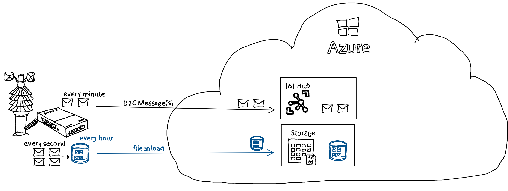
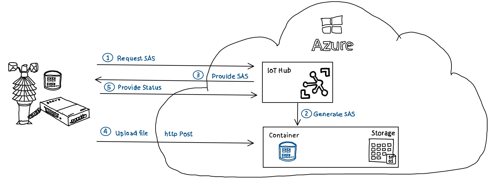
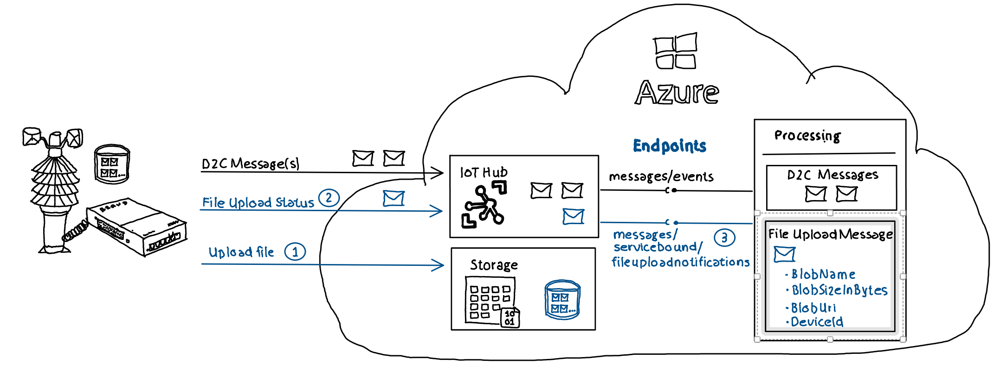

# Azure IoT Hub - File Upload - File Upload Notification

## Basics
In IoT scenarios devices often provide data which need to be analyzed or processed as **stream of data** with low latency. For a weather station this could be e.g. every minute the transfer of current temperature, current air pressure etc. Additionaly there is quite often a need to upload **batched data** to the cloud for analysis or storage. To stay with the example of a weather station, this could be the mentioned temperature and air pressure messarued with a frequency of e.g. every second, stored in a file where the file is uploaded e.g. every hour. 



## File upload - Behind the scenes

### Overview 

IoT Hub acts for the file upload as a dispatcher instead of handling file uploads directly. IoT Hub provides on request of a device an [Azure Account Storage Shared Access Signature](https://learn.microsoft.com/en-us/azure/storage/common/storage-sas-overview) which can be used by the device to http post a file directly to an Azure Storage Account. 

The actual file upload takes place in direct communication between the device and Azure Storage Account. The device uses the Shared Access Signature (SaS) Uri provided by IoT Hub to perform an http post to a file in an Azure Storage Account container and to update IoT Hub regarding the file upload:

  

1. Device requests SAS Uri from IoT Hub
2. IoT Hub generates SAS Uri from linked Storage Account
3. IoT Hub provides SAS Uri to device
4. Device uses SAS Uri to post file to Storage Account
5. Device updates IoT Hub regarding successful / failed upload

## Processing uploaded files

### IoT Hub Endpoints

IoT Hub provides multiple so called EndPoints where it can route messages to. Consuming applications can reach out to this endpoints to receive IoT Hub messages. 

The default endpoint for device to cloud messages is ***messages/events***. Just like device to cloud messages are routed as a default to messages/events, file upload messages are routed to ***messages/servicebound/fileuploadnotification***. From this endpoint custom logic can pick up the information that a file was uploaded and process the file further. The message is triggered (3) after a device has uploaded a file (1) and has sent the successful file upload status message (2).




## SDK support / Example application
The Azure IoT SDK simplifies retrieving file upload notifications from IoT Hub.   

```C#
ServiceClient serviceClient = ServiceClient.CreateFromConnectionString(serviceConnectionString);
var fileNotificationReceiver = serviceClient.GetFileNotificationReceiver();
CancellationToken cancellationToken = new CancellationToken(); 

while (true) 
{
    FileNotification fileNotification = await fileNotificationReceiver.ReceiveAsync(cancellationToken); 
    if (fileNotification == null)
        continue; 
        
    await fileNotificationReceiver.CompleteAsync(fileNotification,cancellationToken);
}
``` 

## Example Code

An end-to-end example in this repo highlights:

- [Creation of all Azure services (IoT Hub, Storage Account) + configuration of IoT Hub to allow file uploading](src/EnvCreation/)
- [IoT Hub Device which uploads 5 files using IoT Hub](src/FileUpload.DemoDevice/)
- [C# console application which retrieves file upload notifications from IoT Hub](src/FileUpload.UploadNotificationService/)