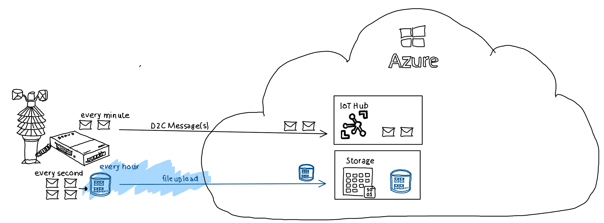

# Device simulator (c# console application)

## Overview



Function *IoTHubFileUploadI()* is called 5 times uploading the same file: 

```c#
internal async Task<bool> IoTHubFileUpload(string fileName, string blobFileName)
    {
        FileUploadCompletionNotification fileUploadCompletionNotification; 

        Console.WriteLine($"Uploading: {fileName} as {blobFileName}");
        using var fileStreamSource = new FileStream(fileName, FileMode.Open);
        fileName = Path.GetFileName(fileStreamSource.Name); 

        var fileUploadSasUriRequest = new FileUploadSasUriRequest {
                BlobName = blobFileName
        };

        FileUploadSasUriResponse sasUri = await _deviceClient.GetFileUploadSasUriAsync(fileUploadSasUriRequest); 
        Uri uploadUri = sasUri.GetBlobUri(); 
        try {
            BlockBlobClient blockBlobClient = new BlockBlobClient(uploadUri);
            await blockBlobClient.UploadAsync(fileStreamSource, new BlobUploadOptions());
        } 
        catch (Exception ex) 
        {
            fileUploadCompletionNotification = new FileUploadCompletionNotification(){
                CorrelationId = sasUri.CorrelationId,
                IsSuccess = false
            };
            await _deviceClient.CompleteFileUploadAsync(fileUploadCompletionNotification);
            Console.WriteLine($"Error during upload: {ex.Message}");
            return false; 
        }

        fileUploadCompletionNotification = new FileUploadCompletionNotification(){
            CorrelationId = sasUri.CorrelationId, 
            IsSuccess = true
        };
        await _deviceClient.CompleteFileUploadAsync(fileUploadCompletionNotification);
        Console.WriteLine($"Successfully uploaded!");

        return true; 
    }
    ``` 
