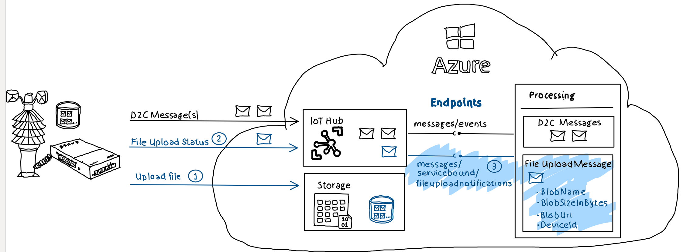

# c# console application

## Overview



The IoT SDK provides a *ServiceClient* object which can be used to create an instance of    *FileNotificationReceiver* which provides a method *ReceiveAsync()* which can be used to retrieve file upload notifications:

```c#
ServiceClient serviceClient = ServiceClient.CreateFromConnectionString(serviceConnectionString);
var fileNotificationReceiver = serviceClient.GetFileNotificationReceiver();
CancellationToken cancellationToken = new CancellationToken(); 

while (true) 
{
    Console.WriteLine("Checking for file upload...");
    FileNotification fileNotification = await fileNotificationReceiver.ReceiveAsync(cancellationToken); 
    if (fileNotification == null)
        continue; 
        
    Console.WriteLine($"Uploaded File: {fileNotification.BlobName}"); 
    await fileNotificationReceiver.CompleteAsync(fileNotification,cancellationToken);
}
```
 